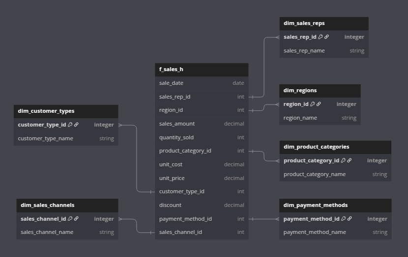
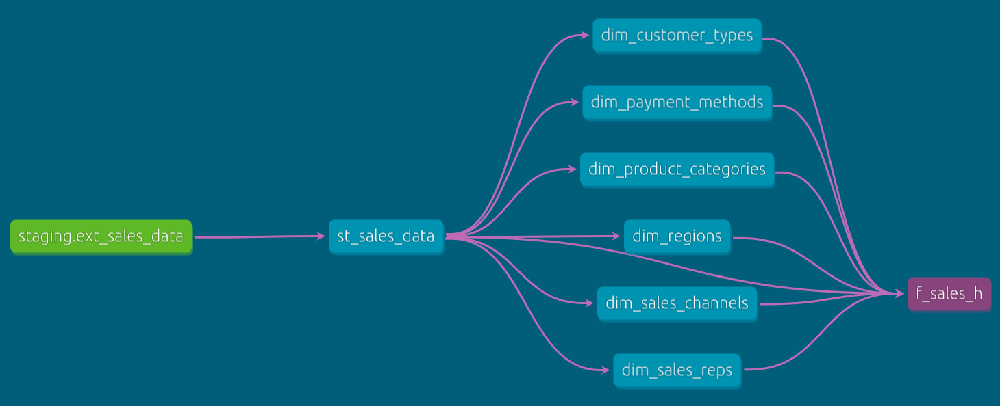

# <div align="center">Data Warehouse</div>

## Overview

In this section we will examine how to build our data warehouse on top of the file we uploaded to GCS. We have chosen dbt and Google BigQuery for this purpose.

In the previous section we did a little bit of set-up for dbt, but now we will start using it to apply our data transformations to the source file and create our data warehouse model.

## Setup

### Initiallize dbt

1. Navigate to [Airflow UI](http://localhost:8080/home)

2. Execute DAG `04_dbt_init` from the Airflow homepage

This DAG can be inspected [here](../02_workflow_orchestration/dags/04_dbt_init.py). It consists of two BashOperator tasks - `dbt_debug` and `dbt_deps`:

- `dbt_debug` - this task calls [this bash script](../02_workflow_orchestration/scripts/dbt/debug.sh), which navigates to the dbt project directory on the container and performs `dbt debug`. What this command does is it tests the database connection to make sure everything is working fine.

- `dbt_deps` - this task calls [this bash script](../02_workflow_orchestration/scripts/dbt/deps.sh), which navigates to the dbt project directory on the container and performs `dbt deps`. What this command does is it installs the dependencies listed in [packages.yml](./sales_data_warehouse/packages.yml). In our case we have used the `dbt_external_tables` package, which helps us stage our source file in an external table.

### Stage source file in an external table

Execute DAG `05_dbt_stage_source_file` from the Airflow homepage.

This DAG can be inspected [here](../02_workflow_orchestration/dags/05_dbt_stage_source_file.py). It consists of a single BashOperator task that calls [this bash script](../02_workflow_orchestration/scripts/dbt/stage_external_sources.sh), which navigates to the dbt project directory on the container and performs `dbt run-operation stage_external_sources`. This is from the package we previously mentioned which stages our source file in an external table.

### Build Data Warehouse model

Execute DAG `06_dbt_build` from the Airflow homepage.

This DAG can be inspected [here](../02_workflow_orchestration/dags/06_dbt_build.py). It consists of a single BashOperator task that calls [this bash script](../02_workflow_orchestration/scripts/dbt/build.sh), which navigates to the dbt project directory on the container and performs `dbt build`. This will build our entire Data Warehouse model.

## Data Warehouse model 

Our data warehouse is comprised of two areas - `sales_dataset_staging` and `sales_dataset_main`. The main area depends on the staging area. By executing DAG `06_dbt_build`, we will be building upon the external table we created in DAG `05_dbt_stage_source_file`. 

### Building the `sales_dataset_staging` area

dbt will, because of the above dependency, build the model defined in [./sales_data_warehouse/models/staging/](./sales_data_warehouse/models/staging/) first.

Examining [./sales_data_warehouse/models/staging/schema.yml](./sales_data_warehouse/models/staging/schema.yml), we can see that we have defined the external table `sales_dataset_staging.ext_sales_data` as a source for the model `sales_dataset_staging.st_sales_data`.

The idea here is to create a native table partitioned by Sale_Date that mirrors the external table's data, upon which to build our warehose. This is achieved by dbt building model [st_sales_data](./sales_data_warehouse/models/staging/st_sales_data.sql) first. 

### Building the `sales_dataset_main` area

Next, dbt will proceed with creating our main warehouse area by building the models defined in [./sales_data_warehouse/models/main/](./sales_data_warehouse/models/main/).

Examining [./sales_data_warehouse/models/main/schema.yml](./sales_data_warehouse/models/main/schema.yml), we can see that this area consists of 6 dimension tables and one fact table. The fact table depends on the dimension tables in order to achieve 3NF.

In essence, we are building a star schema:



Because of this dependency, dbt will first build our dimension tables.

Each dimension table is built by fetching the respective distinct dimension values from the staging table, and appending unique integer values as IDs for each dimension value. For instance - `dim_customer_types:`

```sql
{{
    config(
        materialized = 'table'
    )
}}

with customer_types as (
    select 
        distinct(Customer_Type) as customer_type_name
    from {{ ref('st_sales_data') }}
)

select
    row_number() over ()as customer_type_id,
    customer_type_name
from customer_types
order by 1
```

Once all the dimension tables are built, dbt will build our final model - the historical fact table `f_sales_h`. We are aiming for 3NF here, so we will be joining all our dimension tables with the staging table by their respective dimension names, and pulling out their dimension IDs instead:

```sql
{{
    config(
        materialized = 'table',
        partition_by = {
            "field": "Sale_Date",
            "data_type": "date",
            "granularity": "day"
        },
        cluster_by = [
            "sales_rep_id",
            "region_id",
            "product_category_id",
            "customer_type_id"
        ]
    )
}}

select
    Sale_Date as sale_date,
    sales_reps.sales_rep_id,
    regions.region_id,
    Sales_Amount as sales_amount,
    Quantity_Sold as quantity_sold,
    product_categories.product_category_id,
    Unit_Cost as unit_cost,
    Unit_Price as unit_price,
    customer_types.customer_type_id,
    Discount as discount,
    payment_methods.payment_method_id,
    sales_channels.sales_channel_id
from {{ ref('st_sales_data') }} st
join {{ ref('dim_sales_reps') }} as sales_reps
    on st.Region_and_Sales_Rep = split(sales_reps.sales_rep_name, ' ')[offset(1)] || '-' || split(sales_reps.sales_rep_name, ' ')[offset(0)]
join {{ ref('dim_regions') }} as regions
    on st.Region = regions.region_name
join {{ ref('dim_product_categories') }} as product_categories
    on st.Product_Category = product_categories.product_category_name
join {{ ref('dim_customer_types') }} as customer_types
    on st.Customer_Type = customer_types.customer_type_name
join {{ ref('dim_payment_methods') }} as payment_methods
    on st.Payment_Method = payment_methods.payment_method_name
join {{ ref('dim_sales_channels') }} as sales_channels
    on st.Sales_Channel =  sales_channels.sales_channel_name
```

### Running tests

dbt will finally run all tests specified in [./sales_data_warehouse/models/main/schema.yml](./sales_data_warehouse/models/main/schema.yml) to ensure required data quality is met.

The entire process of building our data warehouse and performing data quality testing can be seen in detail if we follow dbt's console output in our Airflow DAG's log:

```bash
Running with dbt=1.9.3
Registered adapter: bigquery=1.9.1
Found 8 models, 36 data tests, 1 source, 542 macros

Concurrency: 1 threads (target='dev')

1 of 44 START sql table model sales_dataset_staging.st_sales_data .............. [RUN]
1 of 44 OK created sql table model sales_dataset_staging.st_sales_data ......... [CREATE TABLE (1.0k rows, 102.4 KiB processed) in 7.62s]
2 of 44 START sql table model sales_dataset_main.dim_customer_types ............ [RUN]
2 of 44 OK created sql table model sales_dataset_main.dim_customer_types ....... [CREATE TABLE (2.0 rows, 7.8 KiB processed) in 2.91s]
3 of 44 START sql table model sales_dataset_main.dim_payment_methods ........... [RUN]
3 of 44 OK created sql table model sales_dataset_main.dim_payment_methods ...... [CREATE TABLE (3.0 rows, 11.2 KiB processed) in 2.96s]
4 of 44 START sql table model sales_dataset_main.dim_product_categories ........ [RUN]
4 of 44 OK created sql table model sales_dataset_main.dim_product_categories ... [CREATE TABLE (4.0 rows, 9.9 KiB processed) in 2.99s]
5 of 44 START sql table model sales_dataset_main.dim_regions ................... [RUN]
5 of 44 OK created sql table model sales_dataset_main.dim_regions .............. [CREATE TABLE (4.0 rows, 6.3 KiB processed) in 3.22s]
6 of 44 START sql table model sales_dataset_main.dim_sales_channels ............ [RUN]
6 of 44 OK created sql table model sales_dataset_main.dim_sales_channels ....... [CREATE TABLE (2.0 rows, 7.8 KiB processed) in 3.14s]
7 of 44 START sql table model sales_dataset_main.dim_sales_reps ................ [RUN]
7 of 44 OK created sql table model sales_dataset_main.dim_sales_reps ........... [CREATE TABLE (20.0 rows, 11.7 KiB processed) in 3.02s]
8 of 44 START test not_null_dim_customer_types_customer_type_id ................ [RUN]
8 of 44 PASS not_null_dim_customer_types_customer_type_id ...................... [PASS in 0.97s]
9 of 44 START test not_null_dim_customer_types_customer_type_name .............. [RUN]
9 of 44 PASS not_null_dim_customer_types_customer_type_name .................... [PASS in 1.00s]
10 of 44 START test unique_dim_customer_types_customer_type_id ................. [RUN]
10 of 44 PASS unique_dim_customer_types_customer_type_id ....................... [PASS in 0.97s]
11 of 44 START test unique_dim_customer_types_customer_type_name ............... [RUN]
11 of 44 PASS unique_dim_customer_types_customer_type_name ..................... [PASS in 1.00s]
12 of 44 START test not_null_dim_payment_methods_payment_method_id ............. [RUN]
12 of 44 PASS not_null_dim_payment_methods_payment_method_id ................... [PASS in 0.89s]
13 of 44 START test not_null_dim_payment_methods_payment_method_name ........... [RUN]
13 of 44 PASS not_null_dim_payment_methods_payment_method_name ................. [PASS in 0.92s]
14 of 44 START test unique_dim_payment_methods_payment_method_id ............... [RUN]
14 of 44 PASS unique_dim_payment_methods_payment_method_id ..................... [PASS in 0.98s]
15 of 44 START test unique_dim_payment_methods_payment_method_name ............. [RUN]
15 of 44 PASS unique_dim_payment_methods_payment_method_name ................... [PASS in 0.92s]
16 of 44 START test not_null_dim_product_categories_product_category_id ........ [RUN]
16 of 44 PASS not_null_dim_product_categories_product_category_id .............. [PASS in 0.98s]
17 of 44 START test not_null_dim_product_categories_product_category_name ...... [RUN]
17 of 44 PASS not_null_dim_product_categories_product_category_name ............ [PASS in 1.08s]
18 of 44 START test unique_dim_product_categories_product_category_id .......... [RUN]
18 of 44 PASS unique_dim_product_categories_product_category_id ................ [PASS in 0.91s]
19 of 44 START test unique_dim_product_categories_product_category_name ........ [RUN]
19 of 44 PASS unique_dim_product_categories_product_category_name .............. [PASS in 0.91s]
20 of 44 START test not_null_dim_regions_region_id ............................. [RUN]
20 of 44 PASS not_null_dim_regions_region_id ................................... [PASS in 0.97s]
21 of 44 START test not_null_dim_regions_region_name ........................... [RUN]
21 of 44 PASS not_null_dim_regions_region_name ................................. [PASS in 0.91s]
22 of 44 START test unique_dim_regions_region_id ............................... [RUN]
22 of 44 PASS unique_dim_regions_region_id ..................................... [PASS in 1.00s]
23 of 44 START test unique_dim_regions_region_name ............................. [RUN]
23 of 44 PASS unique_dim_regions_region_name ................................... [PASS in 0.95s]
24 of 44 START test not_null_dim_sales_channels_sales_channel_id ............... [RUN]
24 of 44 PASS not_null_dim_sales_channels_sales_channel_id ..................... [PASS in 0.86s]
25 of 44 START test not_null_dim_sales_channels_sales_channel_name ............. [RUN]
25 of 44 PASS not_null_dim_sales_channels_sales_channel_name ................... [PASS in 1.08s]
26 of 44 START test unique_dim_sales_channels_sales_channel_id ................. [RUN]
26 of 44 PASS unique_dim_sales_channels_sales_channel_id ....................... [PASS in 0.84s]
27 of 44 START test unique_dim_sales_channels_sales_channel_name ............... [RUN]
27 of 44 PASS unique_dim_sales_channels_sales_channel_name ..................... [PASS in 0.94s]
28 of 44 START test not_null_dim_sales_reps_sales_rep_id ....................... [RUN]
28 of 44 PASS not_null_dim_sales_reps_sales_rep_id ............................. [PASS in 0.88s]
29 of 44 START test not_null_dim_sales_reps_sales_rep_name ..................... [RUN]
29 of 44 PASS not_null_dim_sales_reps_sales_rep_name ........................... [PASS in 0.90s]
30 of 44 START test unique_dim_sales_reps_sales_rep_id ......................... [RUN]
30 of 44 PASS unique_dim_sales_reps_sales_rep_id ............................... [PASS in 0.94s]
31 of 44 START test unique_dim_sales_reps_sales_rep_name ....................... [RUN]
31 of 44 PASS unique_dim_sales_reps_sales_rep_name ............................. [PASS in 0.93s]
32 of 44 START sql table model sales_dataset_main.f_sales_h .................... [RUN]
32 of 44 OK created sql table model sales_dataset_main.f_sales_h ............... [CREATE TABLE (1.0k rows, 102.3 KiB processed) in 7.58s]
33 of 44 START test not_null_f_sales_h_customer_type_id ........................ [RUN]
33 of 44 PASS not_null_f_sales_h_customer_type_id .............................. [PASS in 1.11s]
34 of 44 START test not_null_f_sales_h_discount ................................ [RUN]
34 of 44 PASS not_null_f_sales_h_discount ...................................... [PASS in 1.08s]
35 of 44 START test not_null_f_sales_h_payment_method_id ....................... [RUN]
35 of 44 PASS not_null_f_sales_h_payment_method_id ............................. [PASS in 1.33s]
36 of 44 START test not_null_f_sales_h_product_category_id ..................... [RUN]
36 of 44 PASS not_null_f_sales_h_product_category_id ........................... [PASS in 1.17s]
37 of 44 START test not_null_f_sales_h_quantity_sold ........................... [RUN]
37 of 44 PASS not_null_f_sales_h_quantity_sold ................................. [PASS in 1.29s]
38 of 44 START test not_null_f_sales_h_region_id ............................... [RUN]
38 of 44 PASS not_null_f_sales_h_region_id ..................................... [PASS in 1.08s]
39 of 44 START test not_null_f_sales_h_sale_date ............................... [RUN]
39 of 44 PASS not_null_f_sales_h_sale_date ..................................... [PASS in 1.00s]
40 of 44 START test not_null_f_sales_h_sales_amount ............................ [RUN]
40 of 44 PASS not_null_f_sales_h_sales_amount .................................. [PASS in 1.08s]
41 of 44 START test not_null_f_sales_h_sales_channel_id ........................ [RUN]
41 of 44 PASS not_null_f_sales_h_sales_channel_id .............................. [PASS in 1.10s]
42 of 44 START test not_null_f_sales_h_sales_rep_id ............................ [RUN]
42 of 44 PASS not_null_f_sales_h_sales_rep_id .................................. [PASS in 1.06s]
43 of 44 START test not_null_f_sales_h_unit_cost ............................... [RUN]
43 of 44 PASS not_null_f_sales_h_unit_cost ..................................... [PASS in 1.09s]
44 of 44 START test not_null_f_sales_h_unit_price .............................. [RUN]
44 of 44 PASS not_null_f_sales_h_unit_price .................................... [PASS in 1.17s]

Finished running 8 table models, 36 data tests in 0 hours 1 minutes and 11.82 seconds (71.82s).

Completed successfully
```

## dbt Docs

You may have noticed that we have been documenting our coulmn names, data types, descriptions, and data quality tests in our `schema.yml` files. This is because dbt supports document generation based on those files.

These documents include but are not limited to the above information. They also contain info on any macros and packages used in the project.

If you would like to generate the docs for our project, make sure to instal dbt-core locally first:

```bash
pip install dbt-core
```

Now navitage to directory `.../sales-data-solution/03_data_warehouse/sales_data_warehouse/` and run:

```bash
dbt docs generate
```

This will generate the documents server files.

Now run:

```bash
dbt docs serve --port XXXX #Replace 'XXXX' with an unused port you would like to have the docs served on
```

You will now be redirected to a browser window where you can browse the documentation at your leisure.

There is a nifty data lineage feature that can help us display the process of building the data warehouse graphically in the bottom right corner of the docs page. Our dbt workflow looks like this:



We have now successfully built our data warehouse model. Let us move on to building some [dashboards](../README.md#dashboards).