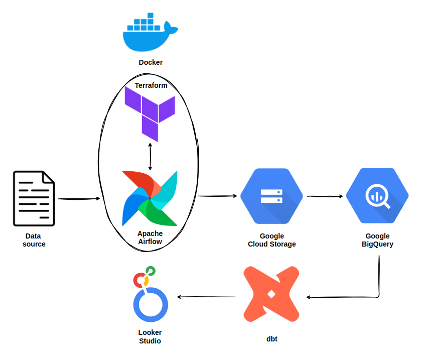

# <div align="center">Sales Data Warehousing & Analysis</div>

## Problem Definition

As a data engineerig/analytics contractor, we have been approached by a new retailer store company that lack a solution for storing and analyzing their sales data for 2023. They want us to help them build an end-to-end solution around their data set, and to assist in analyzing and optimizing their data.

Our plan is to create a data warehouse around their data, and to then build an analytics solution on top, providing actionable insights that will help the company understand trends, identify key opportunities, enhance their sales strategies for sustained growth and success, make data-informed decisions, and improve overall business performance.

## Action Plan

We will be employing the following technologies within this project:

1. **Docker** - Containerization

2. **Apache Ariflow** - Pipeline orchestration

3. **Terraform** - Deployment of cloud infrastructure

4. **Google Cloud Storage** - Raw data storage

5. **Google BigQuery** - Data warehousing

6. **dbt** - Data warehouse modeling

7. **Looker Studio** - Data visualization

The diagram below provides a high-level visual representation of the solution we are implementing for our customer:



## Prerequisites

### Google Cloud Account

Please visit https://cloud.google.com/ in order to set up your Google Cloud account.

### Docker Engine

To find out how to install Docker Engine, please visit https://docs.docker.com/engine/install/.

### Docker Compose

Depending on your OS and/or installation method of choice, you might need to install Docker Compose. Please visit https://docs.docker.com/compose/install/ to learn more.

## The Dataset

Before we begin implementing our solution, we must first inspect the dataset to make sure that the data quality suits our needs:

[Dataset Information and Exploration](./01_dataset/README.md)

The above document can also be found as a notebook [here](./01_dataset/dataset_exploration.ipynb).

In order to be able to run the notebook, you must first have Python installed on your machine with pip as the default package manager. Then you can install Jupyter Notebook:

```bash
$ pip install notebook
```

And start the service:

```bash
$ jupyter notebook
```

Now you should have the service up and running at http://localhost:8888. You can navigate to the download location of the [notebook](./01_dataset/dataset_exploration.ipynb), download it, and load it locally from the Jupyter Notebook Web UI.

Make sure you adjust the file dowload path in the notebook below to reflect your filesystem before running it:

```python
zip_dir = "/home/intergalacticmule/repos/sales-data-solution/01_dataset/"
```

## Workflow Orchestration

In this part of the solution, we apply the first four points of the [Action Plan](#action-plan), namely Docker, Apache Airflow, Terraform, and Google Cloud Storage.

We will create a dockerized Airflow image that includes an installation of Terraform. We will also install and set up dbt on it in this section, but we will not be using it just yet.

Then we will set up our Google Cloud infrastructure, and upload the data to GCS using Airflow DAGs.

Please refer to [Workflow Orchestration](./02_workflow_orchestration/README.md) for a detailed explanation of the work performed, and how to reproduce it.

## Data Warehouse

Here we use the fourth and fifth points of our [Action Plan](#action-plan) - BigQuery and dbt to help with our data transformation, warehousing, and data quality needs.

We will stage the file we previously uploaded to GCS in an external BigQuery table, then perform all of our data transformations on top to create the warehouse model using dbt, all with the help of a few more Airflow DAGs.

Please refer to [Data Warehouse](./03_data_warehouse/README.md) for a detailed explanation of the work performed, and how to reproduce it.

## Dashboards
